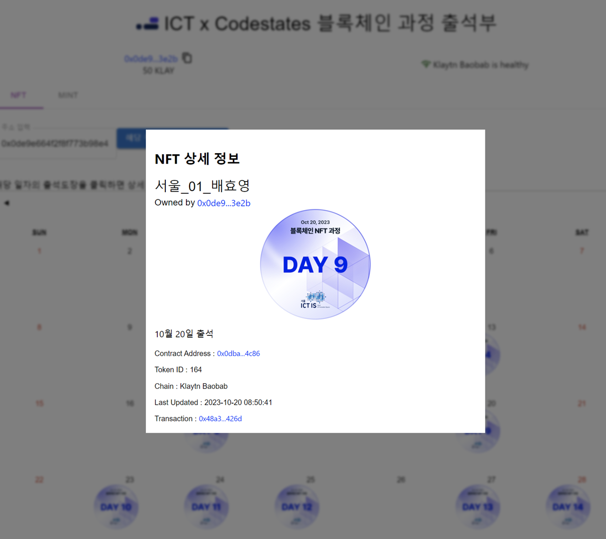
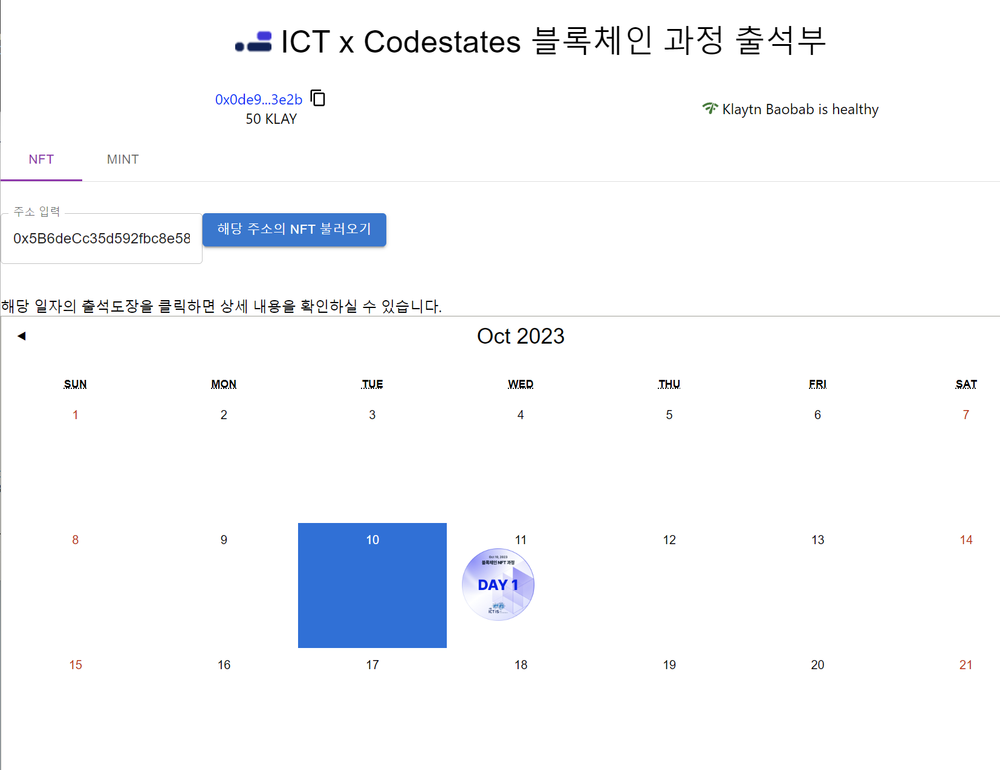
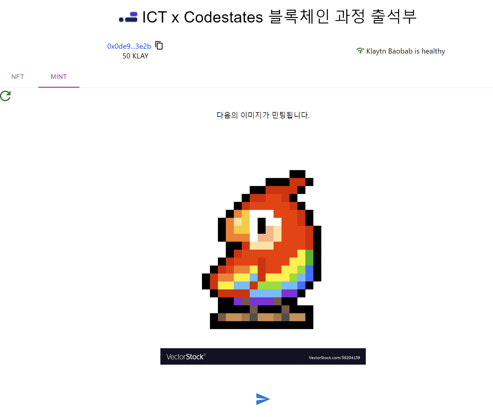
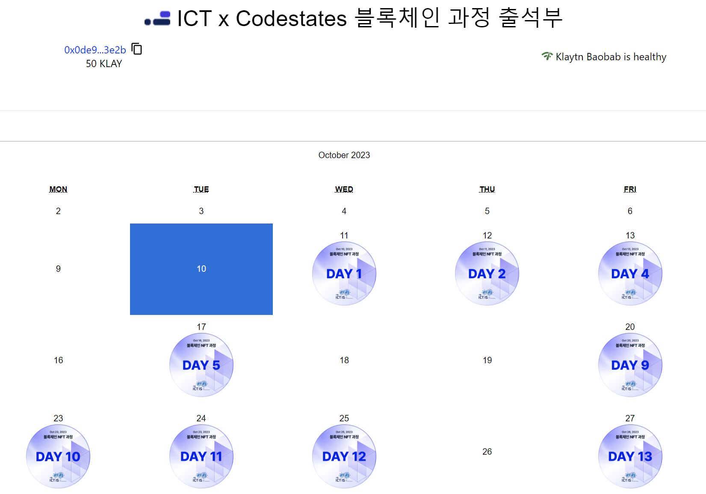
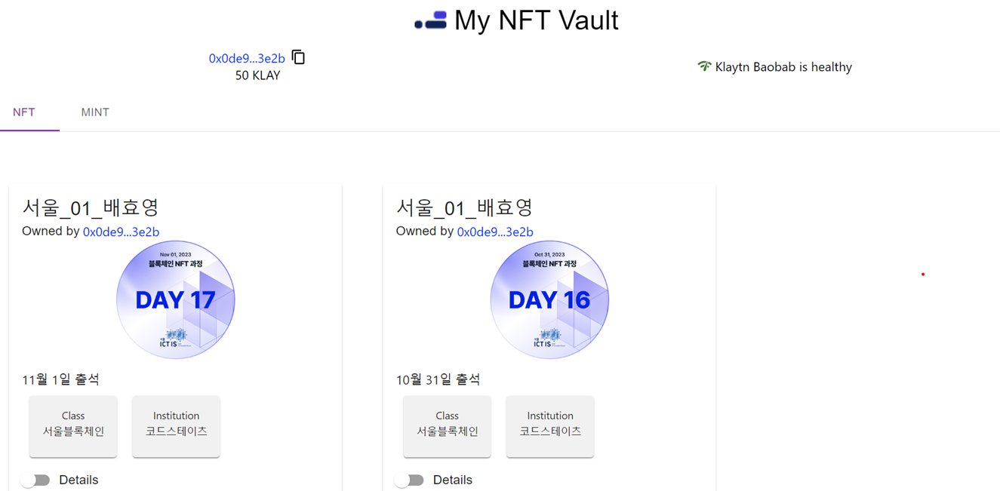

# 코드스테이츠x서울이노베이션스퀘어 블록체인 교육

## 2023-11-03 Front-end 개선 및 기능추가

### 1. 캘린더 형식으로 출석부 확인 가능, 일자 클릭 시 세부정보 확인 가능
[screenshot-20231103-01]



### 2. 공개된 address 이용, 타수강생 출석부 확인 가능
[screenshot-20231103-02]
테스트 주소: 0xFcCe29a8503b1e66FAfDeB76157EcEbfFCf0309b



### 3. Mint 페이지와 Pinata API 연결 완료
[screenshot-20231103-03]



### To Do List
1. NFT 생성일자와 출석일자 미스매칭 문제 일부 있음
2. 나만의 컨트랙트 추가해보기 - `/contract/CodestatesAttend.json` 파일을 `자신의 컨트랙트 ABI파일`로 변경해주세요.

<br />

## 2023-11-02 Front-end 개선 중

[screenshot-20231102]



### To Do List
1. NFT 생성일자 다른데 캘린더 일자 겹치는 문제 해결
2. 나만의 컨트랙트 추가해보기 - `/contract/CodestatesAttend.json` 파일을 `자신의 컨트랙트 ABI파일`로 변경해주세요.
3. MINT 페이지와 Pinata 연결

<br />

## 2023-11-01 기본 세팅 및 NFT 로딩 완료

[screenshot-20231101]



### To Do List
1. 출석부 느낌으로 front-end 개선 
2. 컨트랙트 추가해보기 - `/contract/CodestatesAttend.json` 파일을 `자신의 컨트랙트 ABI파일`로 변경해주세요.

<br />

## 2023-10-31 프로젝트 세팅
### (완료) `.env.example`에 `EOA, Pinata, KAS` API keys를 기입(`.example 삭제`)
### (완료) `shift + command + x` 눌러서 `eslint extension` 설치 (optional)
### (완료) caver 호환성 문제

```js
module.exports = {
    ...
    resolve: {
        fallback: {
            fs: false,
            net: false,
            stream: require.resolve('stream-browserify'),
            crypto: require.resolve('crypto-browserify'),
            http: require.resolve('stream-http'),
            https: require.resolve('https-browserify'),
            os: require.resolve('os-browserify/browser'),
            ...
        },
    },

    plugins: [
      new webpack.ProvidePlugin({
        Buffer: ['buffer', 'Buffer'],
      }),
      ...
    ],
}
```
